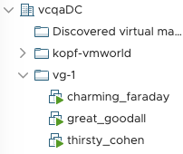

# VMworld 2019 Session: Kubernetes Operators for VMware Enterprise PKS and VMware Cloud PKS [CODE1360U]

## vSphere VM Operator using the Kopf Operator Framework

Purely for inspiration and educational purposes built operator to demonstrate the capabilities of the [Zalando "Kopf" Operator Framework](https://github.com/zalando-incubator/kopf/) for Kubernetes and vSphere at VMworld 2019.

This operator mimics the Kubernetes ReplicaSet controller by managing groups of virtual machines (`kind: VmGroup`). Each `VmGroup` can be individually configured with cpu, memory, the base template from which the VMs (replicas) will be cloned and the desired number of VMs in this group, i.e. replicas. The network configuration is deferred from what's specified in the template used for cloning.

```yaml
apiVersion: vsphere.vmware.com/v1alpha1
kind: VmGroup
metadata:
  name: kopf-vmworld-example
  labels:
    vmworld: "2019"
spec:
  cpu: 1
  memory: 1
  template: kopf-vm-template
  replicas: 3
```

Here is how this VM group with `metadata.name: kopf-vmworld-example` will be synchronized by this operator with vCenter:



> **Note:** Do not use in production! This example and code lacks severe production-grade features, such as input (spec) validation, local queues for state re-sync, task state tracking, sophisticated retries/error handling, finalizers, async (non-blocking) processing etc. For inspiration purposes only. Fork and improve it :)

This documentation is correct as of Kopf v0.20 but might work with later versions as well.

## Installation

>  **Note:** These steps require a running Python >= 3.7 (as per Kopf requirements), Kubernetes >= 1.13 and vSphere (vCenter) environment (not described here). If you don't have Python installed or want a quick way without installing stuff on your machine follow "Option 1: With Docker" below.

Clone the repository:

```bash
$ git clone https://github.com/embano1/kopf-operator-vmworld
$ cd kopf-operator-vmworld
```

The operator will use certain defaults and environment variables for vCenter server information and credentials. You can pass them in when you run the operator, see section [deployment](#deployment) further below. Other settings like ignoring certificate issues and defaults for templates/datacenter/cluster/datastore are currently hard coded in `controller.py`. Please change accordingly before building/ launching the operator:

```python
# controller.py
# vcenter configuration
VC_USER = os.getenv('VC_USER')
VC_PASS = os.getenv('VC_PASS')
VC_HOST = os.getenv('VC_HOST')
VC_PORT = os.getenv('VC_PORT', 443)
INSECURE = True

# hard-coded template settings to clone configuration
TEMPLATE_FOLDER = "kopf-vmworld"    # where to search for templates
DATACENTER = "vcqaDC"               # vSphere data center to target
CLUSTER = "cls"                     # name of the vSphere cluster to target
DATASTORE = "sharedVmfs-0"          # datastore to use for clones
```

### Option 1: With Docker

```bash
# change as needed
$ IMAGE=embano1/kopf-operator-vmworld:$(git rev-parse --short HEAD)
$ docker build -t $IMAGE .
```

### Option 2: Build without Docker

Initialize the Python virtual environment and install dependencies, including the `kopf` executable:

```bash
$ python -m venv .
$ source bin/activate
$ pip install -r requirements.txt
```

If all goes well, you should find `kopf` installed in `./bin`. 

> **Note:** Once you're finished with this tutorial, don't forget to unset your Python virtual environment with `deactivate` in your terminal.

## Deployment

Register the custom API type `VmGroup` (CRD) used for the operator:

```bash
$ kubectl create -f deploy/crd.yaml
customresourcedefinition.apiextensions.k8s.io/vmgroups.vsphere.vmware.com created
```

Create the `VmGroup` example:

> **Note:** At least change `template: kopf-vm-template` to match the template you want to use and make sure you have sufficient resources (cpu, mem, disk) in your target cluster.

```bash
$ kubectl create -f deploy/example.yaml
vmgroup.vsphere.vmware.com/kopf-vmworld-example created
```

If all goes well, we can already check the status of our example in Kubernetes:

```bash
$ kubectl get vg kopf-vmworld-example
NAME                   TEMPLATE           DESIRED   AVAILABLE   PHASE
kopf-vmworld-example   kopf-vm-template   3
```

Since our operator is not running yet, some columns are empty and you won't yet see any activity in vCenter. Our state is only reflected in the Kubernetes API so far. So let's fire up the operator...

### Option 1: Run with Docker

Depending on your Kubernetes environment, the following steps will be different. I am using [kind](https://github.com/kubernetes-sigs/kind) for local development which creates a custom kube config per cluster (".kube/kind-config-kopf" in this example). Thus the local ".kube" folder needs to be mounted into the container with `-v ~/.kube:/home/kopf-operator/.kube`. The container runs as an unprivileged user "kopf-operator". Kopf will detect whether it's running inside a Kubernetes cluster or outside. If the latter, it will try to get the credentials from the environment (if set). This is why we pass the flag `-e KUBECONFIG=/home/kopf-operator/.kube/kind-config-kopf` to the container.

In order for the operator container to connect to the kind cluster, I simply use the host network (there's other - more secure - ways to do so, e.g. linking the containers to the same virtual Docker network). We also need to inject the vCenter connection information as environment variables.

```bash
# if you did not set this variable already during the build phase above do so now (change as needed)
$ IMAGE=embano1/kopf-operator-vmworld:$(git rev-parse --short HEAD)
$ docker run --name kopf-vsphere --network host -it --rm -e VC_USER=administrator@vsphere.local -e VC_PASS='P@ss1234' -e VC_HOST=10.100.100.231 -e KUBECONFIG=/home/kopf-operator/.kube/kind-config-kopf -v ~/.kube:/home/kopf-operator/.kube $IMAGE
```

### Option 2: Run the local Build without Docker

Run the operator to reconcile the state in Kubernetes with vSphere:

> **Note:** When invoking `kopf` directly in the terminal as described below, it will use your current Kubernetes context and credentials. Make sure you have access to a Kubernetes cluster from your terminal and permissions to deploy CRDs and custom resources as used by the examples. 

```bash
VC_USER=administrator@vsphere.local VC_PASS='P@ss1234' VC_HOST=10.100.100.231 kopf run controller.py --verbose
[2019-07-31 23:02:50,822] kopf.clients.auth    [DEBUG   ] Pykube is configured via kubeconfig file.
[2019-07-31 23:02:50,852] kopf.clients.auth    [DEBUG   ] Client is configured via kubeconfig file.
[2019-07-31 23:02:56,906] kopf.engines.peering [WARNING ] Default peering object not found, falling back to the standalone mode.
[2019-07-31 23:02:57,048] kopf.objects         [DEBUG   ] [default/kopf-vmworld-example] Invoking handler 'vm_operator'.
[...]
```

> **Note:** If you want to run this operator inside a Kubernetes cluster as a deployment, follow the Kopf [documentation](https://kopf.readthedocs.io/en/latest/deployment).

Once the operator is running you'll see log information being printed about the actions this vSphere VM Operator performs. Open vCenter to track the progress. If you kept `replicas: 3` in the example you should see three VMs being created in a folder with the name matching `metadata.name` in the example.

Finally validate that the operator has successfully reconciled our example:

```bash
$ kubectl get vg kopf-vmworld-example
NAME                   TEMPLATE           DESIRED   AVAILABLE   PHASE
kopf-vmworld-example   kopf-vm-template   3         3           READY
```

## Functional Flow of the Operator

This flow diagram hopefully helps to better understand the code structure:

<center></center>

## References for Developers

- VMware vSphere API Reference Documentation: https://code.vmware.com/apis/358/vsphere#/doc/right-pane.html
- Some older but still useful pyvmomi object documentations: https://github.com/vmware/pyvmomi/tree/575ab56eb56f32f53c98f40b9b496c6219c161da/docs